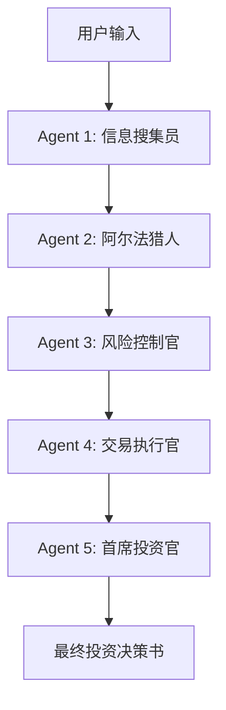

# Janus-Trader: AI 多智能体投资决策系统

[English](./README.md) | 中文

> **项目代号**: Janus (古罗马双面神，象征开始与终结)
> **核心目标**: 模拟专业对冲基金工作流，通过多智能体（Multi-Agent）协作，为 A 股市场提供深度的投资分析与交易决策。

## 1. 系统架构

系统采用线性的 **“瀑布流” (Waterfall) 管线**。每个智能体处理前一个智能体的输出，并添加其自身的专业推演。

## 2. 使用说明

### 工作流程
1. **输入 (Input)**: 将任何补充数据、内参报告或特定新闻放入 `input/YYYYMMDD/` 目录（例如：`input/20260130/603259.txt`）。
2. **执行 (Execute)**: 指令系统分析特定板块或个股。**信息搜集员 (Data Scout)** 会优先读取本地文件，再结合 Google Search 进行全网扫描。
3. **输出 (Output)**: 最终的投资决议及各智能体的推理过程将作为 Markdown 报告保存至 `output/` 目录。

### 示例
**指令**: *“结合今日 input 目录下的政策简报，分析低空经济板块。”*

**执行过程**:
- **Data Scout** 读取 `input/20260130/603259.txt`。
- 各智能体协同工作（搜集 -> 选股 -> 风控 -> 仓位计算 -> 拍板）。
- **结果** 生成于 `output/wuxi_apptec_analysis_20260130.md`。

## 3. 智能体角色定义 (存储于 `agents/`)
- **Data Scout (信息搜集员)**: 负责获取客观事实、宏观数据及本地情报。
- **Alpha Hunter (选股分析师)**: 挖掘上涨逻辑，寻找高爆发潜力的标的。
- **Risk Officer (风险控制官)**: 寻找逻辑漏洞、财务黑洞及技术压力位。
- **Executor (交易执行官)**: 负责凯利公式仓位计算及 2% 风险金控。
- **CIO (首席投资官)**: 最终拍板，确保盈亏比 ≥ 1:2。

## 4. 目录结构
- `/agents`: 智能体性格与任务定义。
- `/input`: 存放每日补充信息 (按日期分类)。
- `/output`: 存放最终决策报告。
- `GEMINI.md`: 系统运行的核心协议。

---
*注意：本系统仅供模拟研究使用，不构成任何实际投资建议。*
